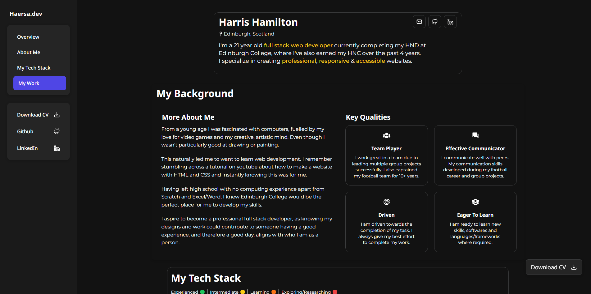

# My Portfolio

# Content Branch

# This branch is used to meet the Outcome 3/4 requirements.

# Changes Made

Each content area has clearly defined headers, folliwng a logical flow through my portfoilios journey.

Each section tag is labelled with clear headings,

### 2. Web Copywriting Techniques

- Used non ambigious easy to read typograhpy.
- Kept paragraphs small to enhcance readability.
- Kept a formal but easy to read tone throughouht the whole website.

### 3. Projects & Developer overview

- Porjects: Added my new Ciao Football project to the My Work section..
- Developer Overview: Kept my key personal skills easy to read in a clearly laid out grid.

### 4. Home Page Additions

- Added new technologies and languages I have since learned from the time I developed my portfolio.
- Changed CSS of certain elements for better responsiveness.
- ***

## Files Modified

- index.html: All content sections added with semantic HTML, copywriting, and IA strategies.
- style.css: Implemented small changes for better readability and responsiveness.
- README.md: Outlinec changes made on this branch.

## 🔗 GitHub Repo

https://github.com/Haersa/Ciao-Football
